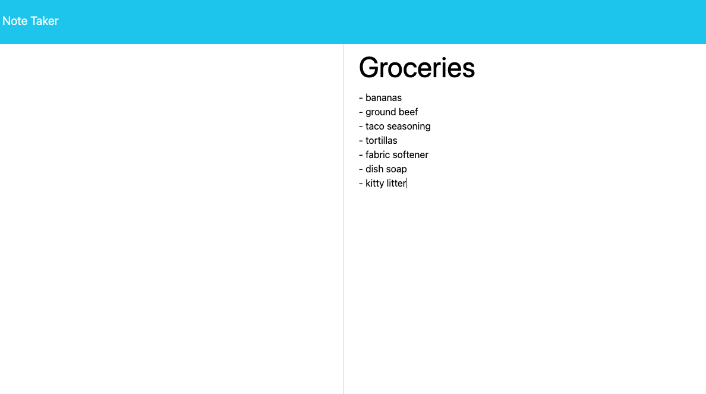
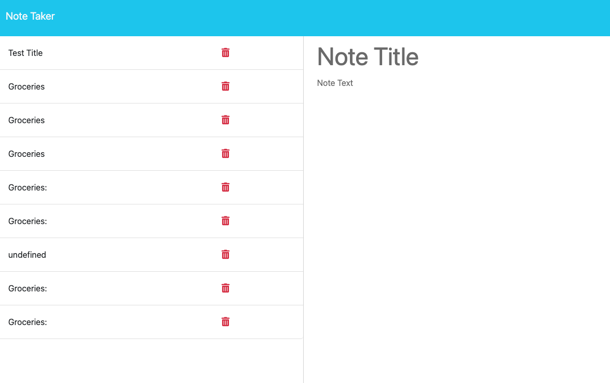

# Express.js Note-Taker

## Description

Project Repository:

 https://github.com/princessjenn/Express-Note-Taker.git

Deployed HEROKU application:

 https://express-notetaker444.herokuapp.com/

`User Story:`

`AS A small business owner`

`I WANT to be able to write and save notes`

`SO THAT I can organize my thoughts and keep track of tasks I need to complete`

`Acceptance Criteria:`

`GIVEN a note-taking application`

`WHEN I open the Note Taker`

`THEN I am presented with a landing page with a link to a notes page` 

`WHEN I click on the link to the notes page`

`THEN I am presented with a page with existing notes listed in the left-hand column, plus empty fields to enter a new note title and the note’s text in the right-hand column`

`WHEN I enter a new note title and the note’s text`

`THEN a Save icon appears in the navigation at the top of the page`

`WHEN I click on the Save icon `

`THEN the new note I have entered is saved and appears in the left-hand column with the other existing notes`

`WHEN I click on an existing note in the list in the left-hand column`

`THEN that note appears in the right-hand column`

`WHEN I click on the Write icon in the navigation at the top of the page`

`THEN I am presented with empty fields to enter a new note title and the note’s text in the right-hand column `

My challenge was to create a Note Taker application that can be used to write and save notes. This application uses an Express.js back-end and will save and retrieve note data from a JSON file.
The application’s front end has already been created with starter code, so my challenge was to build the back end, connect the two, and then deploy the entire application to Heroku.

Firstly, I created the HTML routes, defining a route for `GET /notes` that returns the notes.html file.

Then, I defined a route for `GET * /notes` which returns the index.html file.

Secondly, to connect the back-end, I created the API routes.

I did this by defining a route for `GET /api/notes` that reads the `db.json` file using the fs module, parses the JSON data, and returns all the saved notes as a JSON response.

The, I defined a route for `POST /api/notes` that receives a new note to save in the request body.
I generated a unique ID for the new note by using the uuid package. 

`const { v4: uuidv4 } = require('uuid');`

Next, I defined a route from reading the existing notes from the db.json file using the fs module, and parsed the JSON data.
Then, added the new note to the array of existing notes.

Next, I wrote the updated array of notes back to the db.json file, using the fs module and stringify the JSON data. Then returned the new note as a JSON response.

Finally, I implemented the file storage by creating a db.json file in my Express-Note-Taker directory to serve as the data storage, including an empty array [] in the db.json file to store the notes initially.

## Table of Contents

- [Installation](#installation)
- [Usage](#usage)
- [Contributing](#contributing)
- [Tests](#tests)
- [Questions](#questions)

## Installation

This application will use an 'Express.js' back end and will save and retrieve note data from a JSON file.

We will also use the 'path' package, which is a built-in module that provides utilities for working with file paths.

Lastly we will use the 'uuid' package provides a way to generate unique identifiers.

Command to install these dependencies altogether to our package.json in the root:

`npm install express path uuid`

After installation of the packages required, now we can start using them in the application by requiring/importing the installed modules into the index.js file at the root:

`const express = require('express');`

`const path = require('path');`

`const { v4: uuidv4 } = require('uuid');`

## License 

This project is licensed under the terms of the MIT license.

## Contributing

To contribute to the project: 

1. Start by forking the repository and creating a new branch specifically for your new feature or bug fix.
2. It's important to adhere to the project's coding standards and properly format your code.
3. When committing changes, be sure to write clear and concise messages that describe the changes made.
4. If your contribution affects the user interface or experience, include screenshots or animated GIFs in your pull request to help reviewers understand the changes. 
5. Additionally, make sure your code is thoroughly tested and all existing tests pass before submitting the pull request.
6. Finally, provide a detailed description of your changes and explain why they're necessary.

Thanks for contributing! 

## Tests

To test the application, I performed the following steps:

1. Loaded the application in a web browser to ensure it was running properly.

2. Created a new note by entering a title and text in the corresponding input fields.

3. Clicked the "Save" button to save the note.

4. Verified that the saved note appeared in the sidebar list.

5. Clicked on a saved note in the sidebar list to view its details in the main area. 

6. Edited the title and text of a saved note to make changes.

7. Clicked the "Save" button again to update the note with the changes. 

8. Verified that the updated note was reflected in the sidebar list and main area.

9. Clicked the "Delete" button next to a saved note to remove it.

10. Checked that the deleted note was no longer present in the sidebar list.

These steps helped me ensure that the application's core functionalities, such as creating, saving, editing, and deleting notes, were working as expected.

## Questions

Our Personal Github Repositories:

Jennifer:

https://github.com/princessjenn

Jason:

https://github.com/J3yT

Brian:

https://github.com/Badgers93